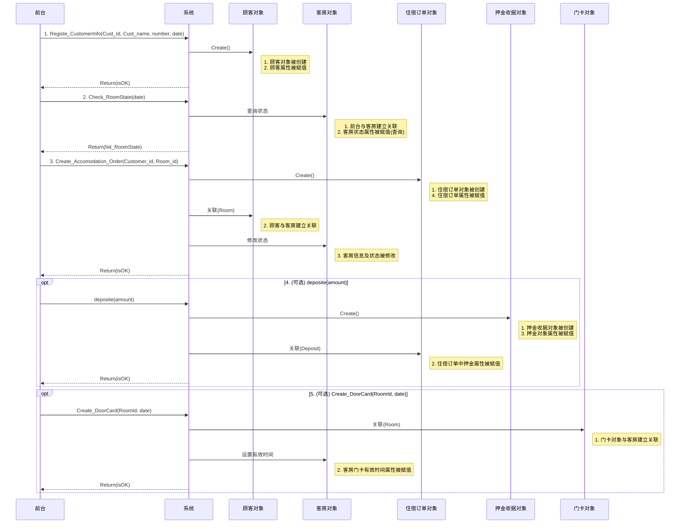

```mermaid
sequenceDiagram
    participant Reception as 前台
    participant System as 系统
    participant Customer as 顾客对象
    participant Room as 客房对象
    participant Order as 住宿订单对象
    participant Deposit as 押金收据对象
    participant DoorCard as 门卡对象

    %% 1. Registe_CustomerInfo
    Reception->>System: 1. Registe_CustomerInfo(Cust_Id, Cust_name, number, date)
    System->>Customer: Create()
    Note right of Customer: 1. 顾客对象被创建<br/>2. 顾客属性被赋值
    System-->>Reception: Return(isOK)

    %% 2. Check_RoomState
    Reception->>System: 2. Check_RoomState(date)
    System->>Room: 查询状态
    Note right of Room: 1. 前台与客房建立关联<br/>2. 客房状态属性被赋值(查询)
    System-->>Reception: Return(list_RoomState)

    %% 3. Create_Accomodation_Order
    Reception->>System: 3. Create_Accomodation_Order(Customer_id, Room_id)
    System->>Order: Create()
    Note right of Order: 1. 住宿订单对象被创建<br/>4. 住宿订单属性被赋值
    
    System->>Customer: 关联(Room)
    Note right of Customer: 2. 顾客与客房建立关联
    
    System->>Room: 修改状态
    Note right of Room: 3. 客房信息及状态被修改
    
    System-->>Reception: Return(isOK)

    %% 4. deposite (Optional)
    opt 4. (可选) deposite(amount)
        Reception->>System: deposite(amount)
        System->>Deposit: Create()
        Note right of Deposit: 1. 押金收据对象被创建<br/>3. 押金对象属性被赋值
        
        System->>Order: 关联(Deposit)
        Note right of Order: 2. 住宿订单中押金属性被赋值
        System-->>Reception: Return(isOK)
    end

    %% 5. Create_DoorCard (Optional)
    opt 5. (可选) Create_DoorCard(RoomId, date)
        Reception->>System: Create_DoorCard(RoomId, date)
        System->>DoorCard: 关联(Room)
        Note right of DoorCard: 1. 门卡对象与客房建立关联
        
        System->>Room: 设置有效时间
        Note right of Room: 2. 客房门卡有效时间属性被赋值
        
        System-->>Reception: Return(isOK)
    end
```